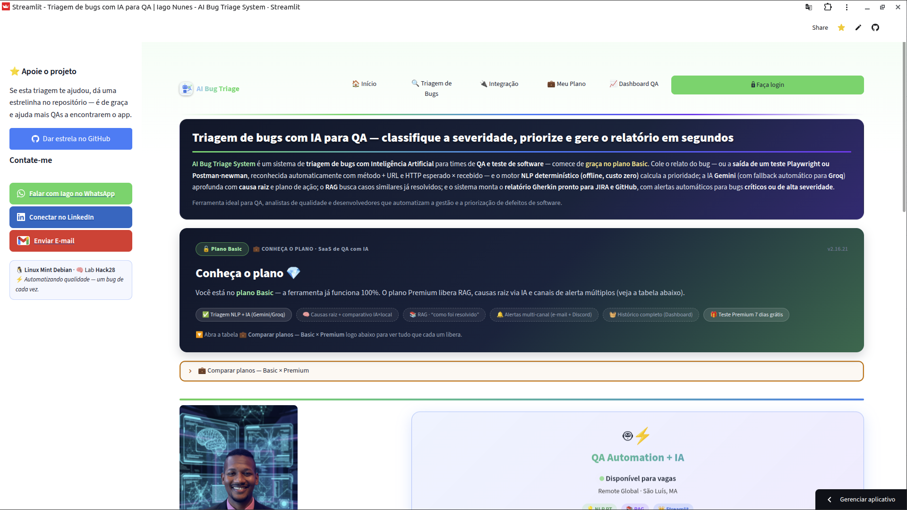

<div align="center">
  
</div>



> 🌐 *English readers: this document is in PT-BR, but your browser can translate it automatically (right-click → "Translate").*

Motor de **triagem inteligente de bugs** desenvolvido para Engenharia de Garantia de Qualidade (QA). Ele combina processamento de linguagem natural (NLP) com lógica de regras para **priorizar automaticamente** relatos de erros e gerar **documentação técnica em formato Gherkin** — pronto para copiar para Jira ou GitHub Issues.

<div align="center">
  <a href="https://ai-bug-triage-system-d6vigycbjt4qxez2wrvsxf.streamlit.app/">
    
  </a>
</div>

<div align="center">
  <a href="https://github.com/Iago3-stack/ai-bug-triage-system/stargazers">
    
  </a>
  <a href="https://github.com/Iago3-stack/ai-bug-triage-system/actions/workflows/ci.yml">
    
  </a>
</div>

<div align="center">
  
  
  
  <a href="docs/README.md"></a>
</div>

> ⭐ **Se esta triagem te ajudou, dá uma estrelinha no projeto** — quanto mais estrelas, mais QAs encontram o app na busca do GitHub. É de graça!

---

<div align="center">
  
</div>

<div align="center">
  
  
  
  
  
  
  
  
  
  
</div>

- 🔵 **Triagem em duas camadas**
  1. **Camada técnica**: termos críticos (crash, pagamento, login, segurança, 500...) escalam a severidade.
  2. **Camada NLP**: análise de sentimento por **léxico em português** + **detecção de negação** ("não funciona", "não consigo", "parou de responder"...).
- 🟣 **Análise por IA (Fase 3)**: quando houver chave `GEMINI_API_KEY`, o app chama o **Google Gemini** e complementa a triagem com severidade sugerida, categoria, **causa raiz provável**, passos para reproduzir e resumo técnico — tudo em JSON estruturado, com **fallback automático** para o motor local se a API falhar.
- 🟢 **Prioridade final reconciliada**: os dois motores são combinados pela regra do **maior vence** (nenhum alerta grave é ignorado) e o app **sinaliza divergência** quando discordam, recomendando revisão humana.
- ⚠️ **100% offline e determinístico**: o motor `triagem.py` usa apenas a biblioteca padrão do Python — sem API de tradução, sem internet, sem custo e com resultado sempre reproduzível.
- 🔷 **Transparência de QA**: o relatório informa o **motor de análise** usado e os **fatores identificados** em cada triagem.
- 💚 **Relatório Gherkin** (`Dado/Quando/Então`) baseado na prioridade detectada.
- 🟠 **Exportação**: baixar relatório (`.md`), abrir **Issue no GitHub** pré-preenchida ou enviar ao **Jira** (configurável).
- ⚪ **Histórico da sessão** em tabela (`pandas`) com opção de limpar.
- 🟫 **Sem falsos positivos técnicos**: palavras como *erro*, *bug* e *falha* são vocabulário normal de teste e **não** disparam severidade sozinhas.
- 🟥 **Interface com identidade visual própria** (tema Streamlit em `config.toml`).

---

<div align="center">
  
</div>

<div align="center">
  
  
  
  
  
</div>

- 🐍 **Python 3.13** — lógica e motor NLP (biblioteca `re` / stdlib)
- 🚀 **Streamlit 1.62** — interface web e deploy na nuvem
- 🔮 **Google Gemini (`google-genai`)** — análise de causa raiz via LLM (Fase 3)
- 🐼 **pandas** — tabela de histórico de triagens
- 🐧 Desenvolvido em **Linux Mint Debian** (Laboratório Hack28)

---

<div align="center">
  
</div>

<div align="center">
  
  
  
  
</div>

```bash
git clone https://github.com/Iago3-stack/ai-bug-triage-system.git   # 📥 clona o repo
cd ai-bug-triage-system                                             # 📂 entra na pasta
python3 -m venv .venv                                                # 🐍 cria o ambiente virtual
source .venv/bin/activate                                            # ⚡ ativa o venv
pip install -r requirements.txt                                      # 📦 instala as dependências
streamlit run home.py                                                # 🚀 roda a aplicação
```

A análise por IA usa a chave `GEMINI_API_KEY` (gratuita em [aistudio.google.com/apikey](https://aistudio.google.com/apikey)). Sem a chave, o app funciona normalmente só com o motor local:

- 🔑 **Local**: crie um arquivo `.env` na raiz com `GEMINI_API_KEY=...` (ele é ignorado pelo `.gitignore`).
- ☁️ **Streamlit Cloud**: `Settings → Secrets → GEMINI_API_KEY` (nunca coloque a chave em código ou no repositório).

🧪 Teste rápido dos motores sem interface:

```bash
python triagem.py   # 🟢 motor determinístico local
python ia.py        # 🔮 análise por IA (Gemini) — exige a chave
```

---

<div align="center">
  
</div>

| Arquivo | Papel |
|---|---|
| 🖥️ `home.py` | Interface web (Streamlit): cabeçalho, ferramenta, export e histórico |
| 🧠 `triagem.py` | Motor NLP: léxico PT, padrões de negação e classificação de severidade (offline) |
| 🔮 `ia.py` | Análise por IA via Google Gemini: causa raiz, categoria e passos (com fallback) |
| 📦 `requirements.txt` | Dependências pinadas |
| 🎨 `.streamlit/config.toml` | Tema e configurações da app |
| 📚 `docs/` | [Documentação de Engenharia de Software](docs/README.md) — requisitos, casos de teste, arquitetura e estratégia de QA |

---

<div align="center">
  
</div>

<div align="center">
  
  
</div>

- ✅ **Fase 1** — Motor NLP offline (léxico PT + negação, sem TextBlob/Google Translate)
- ✅ **Fase 2** — Exportação do relatório, histórico de sessão e identidade visual
- ✅ **Fase 3** — Integração com **LLMs** (Gemini) para análise de causa raiz, categoria e passos — com fallback automático
- ✅ **Testes unitários do motor (`pytest`)** — 12 testes, rodam automaticamente via CI (GitHub Actions)
- ⬜ **Exportação direta via API do Jira**
- ⬜ **Persistência do histórico (banco de dados)**

---

<div align="center">
  
</div>

<div align="center">
  <a href="CHANGELOG.md"></a>
  <a href="LICENSE"></a>
  
  
</div>

**🧑‍💻 Autor:** [Iago Nunes (Iago3-stack)](https://github.com/Iago3-stack) — QA Automation Engineer | Estudante de IA & Machine Learning na UNIASSELVI.

📜 Este projeto é distribuído sob a **licença MIT** (ver arquivo [`LICENSE`](LICENSE)). Qualquer uso, cópia ou modificação **deve manter a atribuição de crédito** ao autor original — remover ou ocultar a autoria viola a licença.

🕓 O histórico completo de construção (commits, datas e motivações) está público em [github.com/Iago3-stack/ai-bug-triage-system](https://github.com/Iago3-stack/ai-bug-triage-system).